# 01 專案概觀

## 1. 研究問題

**目標**：預測 S&P 500 指數（`^GSPC`）未來的趨勢反轉點（波峰 Peak / 波谷 Valley），並以此建立交易策略。

**核心挑戰**：反轉點在日資料中極少（`outputs/reports/summary.json` 中測試期約 1,200 個樣本視窗只對到 26 個反轉），直接做「是否反轉」的分類會有嚴重的類別不平衡。

**本研究的問題轉換**：

```
直接預測反轉（稀有事件）            ✗ 類別極不平衡
        ↓ 改成
預測未來 N=16 天每天的趨勢 (0=上升, 1=下降)   ✓ 兩類較平衡（約 7:3）
        ↓ 後處理
趨勢由 1→0 的那天 = 波谷 (Buy)，0→1 = 波峰 (Sell)
```

這是 multi-label / sequence-to-sequence 的二元分類問題：輸入過去 `look_back=64` 天 × 32 個特徵，輸出未來 `predict_steps=16` 天的趨勢 logits。

## 2. 標籤（Trend）怎麼定義

`preprocessor/featureFactory.py` 的 `IndicatorTrend.calculate_trend_LocalExtrema`：

1. 用 `scipy.signal.argrelextrema(Close, order=20)` 找出前後各 20 個交易日內的局部最高/最低點。
2. `filter_extrema` 讓高低點交錯出現（連續多個高點只留最高的、連續多個低點只留最低的）。
3. 高點→低點之間標為 1（下降趨勢），低點→高點之間標為 0（上升趨勢），其餘 forward-fill。

> 這個標籤本質上是「事後諸葛」：某天是否為極值，需要看到之後 20 天的價格才能決定。作為**預測目標**沒問題，但**不可作為輸入特徵**（舊版實驗有這個問題，見 03）。

## 3. 整體流程（`main.py`）

```mermaid
flowchart LR
    A[yfinance 下載<br/>^GSPC ^IXIC ^DJI ^RUA] --> B[FeatureFactory<br/>25 種特徵 + Trend 標籤]
    B --> C[CleanerMissingValue<br/>auto: 刪開頭 NaN + ffill]
    C --> D[時間切分<br/>train 50% / val 20% / test 30%]
    D --> E[滑動視窗 64→16<br/>每個視窗內 MinMax 正規化]
    E --> F[4 個指數的訓練視窗交錯合併]
    F --> G[Model.train_model<br/>BCEWithLogitsLoss + Adam]
    G --> H[Postprocessor<br/>趨勢序列 → 反轉點 → 買賣訊號]
    H --> I[Evaluator<br/>混淆矩陣 / ROC / 回測 / 圖表]
    I --> J[outputs/reports/*.json<br/>outputs/plots/*.png]
```



- **訓練資料**：4 個美股指數（S&P 500、NASDAQ、道瓊、Russell 3000）各自前 50% 的時間段，視窗逐筆交錯合併（`preprocessor.py:213-216`）。
- **驗證/測試資料**：只用 `^GSPC` 的 50–70%、70–100% 時間段。
- **正規化**：每個 64 天視窗**各自**做 MinMaxScaler（`processorFactory.py:184`），避免跨時間洩漏，但也丟失了絕對水位資訊。

## 4. 資料與特徵

`parameters.json` 的 `feature_cols`（32 欄）：

| 類別 | 欄位 |
|---|---|
| 價量 | Open, High, Low, Close, Volume |
| 趨勢/動能 | MACD_dif/dem/histogram (5,10,9)、ROC(5)、MOM(10)、MA(20)、Parabolic SAR、Aroon Up/Down(14)、ADX(14) |
| 擺盪 | StoK/StoD(5)、CCI(14)、RSI(14)、Williams %R(14)、MFI(14) |
| 波動 | Bollinger upper/middle/lower(20,2)、ATR(14)、3M Volatility（`^VIX3M`） |
| 量能 | OBV、ADL |
| 總經 | 13W / 5Y / 10Y Treasury Yield（`^IRX` `^FVX` `^TNX`） |
| 其他 | pctChange |

另外有計算但未放進 `feature_cols` 的：VMA、30Y Treasury Yield、Chaikin MF。技術指標由 **TA-Lib** 計算（README 的環境清單漏列了 TA-Lib 與 seaborn、scipy）。

**資料期間**：設定為 2001-01-01 ~ 2024-01-01。但 `^VIX3M` 在 Yahoo 的歷史較短，清洗策略 `auto` 會刪除開頭任何含 NaN 的列，所以實際起點較晚。由 `val_summary.json` 第一筆反轉日期（2015-07-20，位於驗證集第 0 個視窗的第 6 天）回推：驗證集起點 ≈ 2015-04，換算 50% 切分點 → 有效資料起點約 **2006 年中**。也就是：

| 集合 | 約略期間 |
|---|---|
| Train | 2006 中 – 2015-04（4 個指數） |
| Validation | 2015-04 – 2018-10（^GSPC） |
| Test | 2018-10 – 2023-12（^GSPC，含 2020 COVID 崩跌、2022 熊市） |

## 5. 主要超參數（`parameters.json` 目前值）

| 參數 | 值 | 備註 |
|---|---|---|
| model_type | `TransformerModel` | 可選 20 種，見 02 |
| look_back / predict_steps | 64 / 16 | |
| training_epoch_num | 10 | 偏少 |
| learning_rate | 1e-5 | 偏小；搭配 10 epochs 幾乎沒訓練到 |
| patience | 100 | > epochs，early stopping 不會觸發 |
| batch_size | 64 | **未使用**，`main.py:55` 寫死 32 |
| apply_weights / weight_before / weight_after | true / 1 / 1 | 權重都是 1，等於沒加權 |
| filter_reverse_trend_train_test | true | 每個 16 天標籤只保留第一次反轉（之後全設為新趨勢） |
| reverse_idx_difference_max/min | ±5 | 預測反轉日與真實反轉日差距 ≤5 天算命中 |
| online_train_*、data_update_mode、filter、resample、shuffle、weight_decay | — | **目前程式未使用**（舊版線上學習功能的殘留） |

## 6. 評估面向

1. **趨勢層級**：16 天 × N 視窗的二元混淆矩陣、ROC-AUC、PR-AUC。
2. **反轉層級**：Peak / Valley / No reversal 三分類混淆矩陣；預測反轉日與實際反轉日的天數差（bar chart、平均絕對差、±5 天內命中數）。
3. **交易層級**：四種回測策略（多空翻轉、加停損、加停損停利、只做多），以 1 股為單位、手續費 0.0008% 計算損益與勝率。

## 7. 專案目錄

```
main.py                 # 主流程（ReversePrediction.run）
main.ipynb              # 同 main.py，分成 cell 執行
parameters.json         # 所有實驗參數
preprocessor/           # 下載、特徵、清洗、切分、視窗化
model/                  # Model 訓練包裝 + ModelFactory（20 種架構）
postprocessor/          # 趨勢 → 反轉 → 交易訊號
evaluator/              # 指標、圖表、回測
outputs/                # 最近一次執行的模型、圖、JSON 報告
log.txt / progress.txt  # 訓練 log 與批次實驗進度（舊）
```
